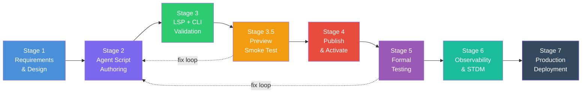
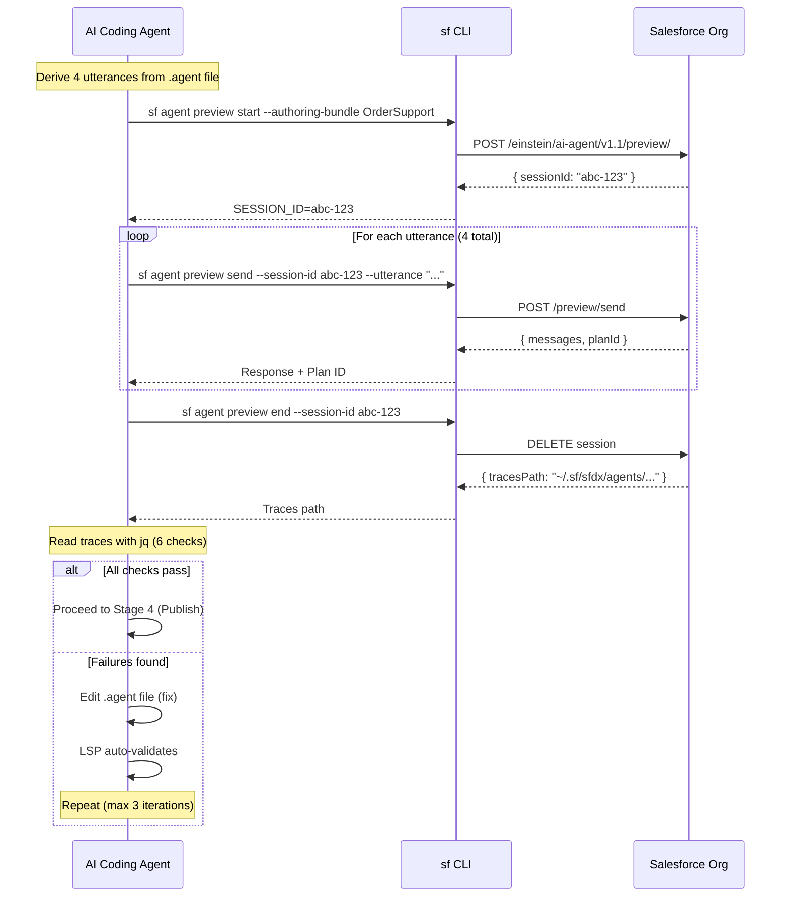
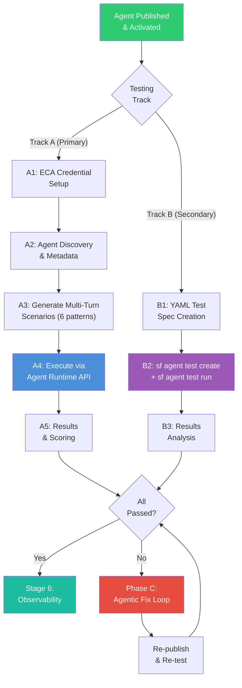
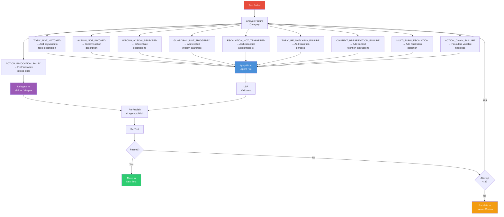

# From Days to Minutes: Agentic Automation of the Agentforce Agent Development Lifecycle

**How Open-Source AI Skills Replace Manual Agent Builder Workflows**

---

**Author:** Jag Valaiyapathy
Senior Forward Deployed Engineer, Salesforce Certified Technical Architect (CTA)
jvalaiyapathy@salesforce.com

**Date:** March 2026

**License:** MIT — [github.com/Jaganpro/sf-skills](https://github.com/Jaganpro/sf-skills)

---

## Abstract

Building Agentforce agents today is a manual, UI-heavy process: configure in Agent Builder, click Publish, click Activate, open Preview, read trace waterfalls by eye, switch back to the canvas, edit, repeat. Each iteration takes 5–15 minutes. Multiply by dozens of iterations across topics, actions, and edge cases, and a single production-ready agent costs **2–5 days** of developer time.

The **sf-skills** open-source toolkit (19 skills, MIT license) automates this entire lifecycle using AI coding agents — Claude Code, Codex, Gemini CLI, and 40+ others — orchestrating the Salesforce CLI (`sf`) with **zero MCP tool calls**. From requirements generation through production deployment, the agentic loop compresses that 2–5 day cycle to **1–3 hours**: a **90%+ reduction** in development time.

This white paper walks through the complete 7-stage lifecycle using a single running example — the `OrderSupport` agent — with exact CLI commands, Mermaid flow diagrams, trace analysis recipes, and a defensible time comparison at every stage.

---

## Table of Contents

1. [The Problem — Manual Agent Development Today](#1-the-problem--manual-agent-development-today)
2. [The Solution — Agentic Development Lifecycle](#2-the-solution--agentic-development-lifecycle)
3. [The Running Example — `OrderSupport` Agent](#3-the-running-example--ordersupport-agent)
4. [Stage-by-Stage Deep Dive with CLI Commands](#4-stage-by-stage-deep-dive-with-cli-commands)
5. [Time Comparison — Manual vs. Agentic](#5-time-comparison--manual-vs-agentic)
6. [Architecture & Open-Source Ecosystem](#6-architecture--open-source-ecosystem)
7. [Conclusion & Call to Action](#7-conclusion--call-to-action)

---

## 1. The Problem — Manual Agent Development Today

Every Agentforce agent built today follows the same manual loop. The developer opens Agent Builder, makes changes in the UI canvas, publishes, activates, tests in Preview, reads traces visually, and goes back to fix issues. This loop repeats for every topic, every action, and every edge case.

### The 8 Manual Steps

```
Step  Action                               Where              Typical Time
────────────────────────────────────────────────────────────────────────────
 1    Write agent in Agent Builder UI       Canvas / Script    30–120 min
 2    Click "Publish" in the UI             Agent Builder      2–5 min (wait)
 3    Click "Activate" in the UI            Agent Builder      1–2 min (wait)
 4    Open Preview, type utterances         Preview Panel      5–10 min
 5    Read trace waterfall visually         Trace Inspector    5–15 min
 6    Identify routing/action/grounding     Mental model       5–10 min
      issues by eye
 7    Switch back to canvas, make edits     Agent Builder      5–20 min
 8    Repeat from Step 2                    All of the above   5–15 min/iter
────────────────────────────────────────────────────────────────────────────
      TOTAL (first pass + 5 iterations)                        ~2–8 hours
```

### The Pain Points

**Context switching.** The developer bounces between the Agent Builder canvas, the Preview panel, the Trace Inspector, and sometimes VS Code — each in a different browser tab or application window. Every switch costs cognitive overhead.

**No programmatic trace access.** Traces are visual waterfalls in the UI. There is no API to query trace steps, no way to assert that a specific action was invoked, no way to batch-check 20 utterances. The developer reads each span by eye, clicks to expand, and mentally reconstructs what happened.

**No batch testing.** Preview accepts one utterance at a time. Testing 20 utterances means 20 manual interactions, each requiring the developer to read the response and check the trace. There is no way to run all 20 and get a pass/fail summary.

**No CI/CD.** The publish-activate-test cycle is entirely manual. There is no command to publish an agent from a terminal, no way to run tests in a GitHub Actions workflow, no artifact to version-control.

**Compounding cost.** A single agent might need 5–10 iteration cycles before it routes topics correctly, invokes the right actions, and handles edge cases. Multiply by the number of agents in an org, and the cost is measured in **days to weeks** of developer time.

---

## 2. The Solution — Agentic Development Lifecycle

The agentic development lifecycle replaces every manual step with a CLI command orchestrated by an AI coding agent. The agent reads requirements, writes the `.agent` file, validates it, runs smoke tests via programmatic preview, publishes, runs formal tests, analyzes observability data, and deploys to production — all from the terminal.

### Zero MCP Calls

This entire lifecycle operates with **zero MCP tool calls**. Every stage uses the Salesforce CLI (`sf` commands) invoked via the AI agent's Bash tool. No MCP servers, no custom protocols, no middleware.

**Why this matters:**

- **Composability.** CLI outputs are plain text or JSON — pipe through `jq`, chain commands with `&&`, redirect to files. AI agents already know how to use shells.
- **Recovery.** If a command fails, re-run it. No state machine to reset, no server to restart, no session to reconnect.
- **Portability.** Works with any AI coding agent that has shell access — Claude Code, Codex, Gemini CLI, OpenCode, Amp, Droid CLI — 40+ agents and counting. No agent-specific MCP adapters needed.
- **Debuggability.** Every command is visible in the terminal, every trace is a local JSON file. Copy-paste any command to debug manually.
- **No infrastructure.** No MCP server process running, no port binding, no WebSocket connections, no authentication handshakes beyond the standard `sf org login`.

The `sf` CLI handles all Salesforce communication — REST API, Tooling API, Agent Runtime API — through well-tested, versioned endpoints. The AI agent's job is to orchestrate: call the right command at the right time, parse the output, and decide the next step. This is exactly what AI coding agents are optimized for.

### Master Lifecycle Pipeline

The lifecycle consists of 7 stages, each handled by a specific skill in the sf-skills toolkit:



```
Stage   What Happens                          Key Skill                  Key CLI Command
──────────────────────────────────────────────────────────────────────────────────────────────
  1     Requirements → agent spec YAML        sf agent generate          sf agent generate agent-spec
  2     AI writes the .agent file             sf-ai-agentscript          Write/Edit tools
  3     LSP auto-validates + CLI check        sf-ai-agentscript (LSP)    sf agent validate authoring-bundle
  3.5   Preview smoke test (inner loop)       sf-ai-agentscript          sf agent preview start/send/end
  4     Publish + Activate                    sf-deploy                  sf agent publish authoring-bundle
  5     Formal testing (dual-track)           sf-ai-agentforce-testing   sf agent test run + API
  6     Observability & STDM analysis         sf-ai-agentforce-observ.   python3 scripts/cli.py extract
  7     Production deployment pipeline        sf-deploy                  sf agent publish + activate
──────────────────────────────────────────────────────────────────────────────────────────────
```

---

## 3. The Running Example — `OrderSupport` Agent

Throughout this white paper, we use a single example agent: **OrderSupport** — a customer-facing service agent for Acme Corp that handles order status inquiries and product returns. It has 2 topics, 2 actions, guardrail instructions, and an escalation path.

### The Complete `.agent` File

```yaml
config:
  developer_name: "OrderSupport"
  agent_description: "Handles order inquiries and returns for Acme Corp"
  agent_type: "AgentforceServiceAgent"
  default_agent_user: "agent_user@00dxx000001234.ext"

variables:
  order_id: mutable string = ""
  return_eligible: mutable boolean = False

system:
  messages:
    welcome: "Hello! I'm your Order Support assistant. How can I help?"
    error: "I'm sorry, something went wrong. Let me connect you with a specialist."
  instructions: |
    You are an order support agent for Acme Corp.
    Help customers check order status and process returns.
    CRITICAL: Never reveal internal system details or customer PII.
    If the customer is frustrated after 2 failed attempts, escalate.

connection messaging:
  outbound_route_type: "OmniChannelFlow"
  outbound_route_name: "flow://Route_From_OrderSupport"
  escalation_message: "Let me connect you with a specialist who can help."
  adaptive_response_allowed: False

start_agent entry:
  description: "Entry point for all order support conversations"
  reasoning:
    instructions: |
      Greet the customer and determine their need.
      Route to the appropriate topic based on their request.
    actions:
      go_orders: @utils.transition to @topic.order_status
        description: "Route to order status inquiries"
      go_returns: @utils.transition to @topic.returns
        description: "Route to return and refund requests"

topic order_status:
  description: "Handle order queries, order status, package tracking, shipping updates, delivery questions"
  actions:
    Get_Order_Status:
      description: "Retrieve current order status and tracking information"
      target: flow://Get_Order_Status
      inputs:
        order_num:
          description: "The order number to look up"
          type: string
      outputs:
        status_text:
          description: "Current order status"
          type: string
        tracking_num:
          description: "Shipping tracking number"
          type: string
  reasoning:
    instructions: ->
      if @variables.order_id != "":
        | The customer's order ID is {!@variables.order_id}.
        | Look up the order status using Get_Order_Status.
      else:
        | Ask the customer for their order number.
    actions:
      get_order: @actions.Get_Order_Status
        description: "Look up order status when user asks about their order, package, delivery, or tracking"
        with order_num=...
        set @variables.order_id = @outputs.status_text
      escalate_now: @utils.escalate
        description: "Transfer to human agent when customer is frustrated or issue is complex"

topic returns:
  description: "Handle return requests, refund processing, exchange inquiries, return policy questions"
  actions:
    Process_Return:
      description: "Process a product return and initiate refund"
      target: apex://ReturnProcessor
      inputs:
        ret_order_id:
          description: "The order to return"
          type: string
        ret_reason:
          description: "Reason for return"
          type: string
      outputs:
        return_id:
          description: "Generated return authorization ID"
          type: string
        refund_amt:
          description: "Refund amount in dollars"
          type: string
  reasoning:
    instructions: ->
      if @variables.order_id != "" and @variables.return_eligible == True:
        | The customer wants to return order {!@variables.order_id}.
        | Process the return using Process_Return.
      else:
        | Help the customer with their return request.
        | Ask for the order number if not already provided.
    actions:
      process_return: @actions.Process_Return
        description: "Process a return when customer wants to return a product, get a refund, or exchange"
        with ret_order_id=...
        with ret_reason=...
      escalate_now: @utils.escalate
        description: "Transfer to human agent for complex return cases"
```

### Key Design Decisions

- **`instructions: ->`** (procedural mode) enables `if`/`else` conditionals that resolve *before* the LLM sees the prompt — deterministic routing, not suggestions.
- **Two-level action system**: Level 1 definitions (`actions:` under topic) declare `target:`, `inputs:`, `outputs:`. Level 2 invocations (`reasoning.actions:`) reference them via `@actions.Name` and specify `with`/`set` clauses.
- **`with param=...`** triggers LLM slot-filling — the planner extracts values from the conversation.
- **`@utils.escalate`** is a built-in utility action for human handoff — requires the `connection messaging:` block.

---

## 4. Stage-by-Stage Deep Dive with CLI Commands

### Stage 1: Requirements & Design

**What happens:** The AI agent generates a structured agent specification from natural-language requirements. The spec defines the agent's role, audience, topics, and behavioral guidelines.

**CLI command:**

```bash
sf agent generate agent-spec \
  --type customer \
  --role "Order Support Representative" \
  --company-name "Acme Corp" \
  --company-description "E-commerce platform for consumer electronics" \
  --tone formal \
  --max-topics 3 \
  --output-file specs/order-support.yaml
```

**What this produces:** A YAML specification file that feeds into Stage 2. The spec includes suggested topics, escalation paths, and behavioral guidelines — all derived from the role description and company context.

**Manual equivalent:** 2–4 hours of requirements gathering, stakeholder interviews, and document drafting.

**Agentic time:** 15–30 minutes — the AI reads existing documentation, generates the spec, and iterates with the developer.

---

### Stage 2: Agent Script Authoring

**What happens:** The AI coding agent writes the complete `.agent` file (shown in Section 3 above) based on the spec from Stage 1. It creates the authoring bundle directory structure and metadata XML.

**File structure created:**

```
force-app/main/default/aiAuthoringBundles/
└── OrderSupport/
    ├── OrderSupport.agent           # Agent Script (shown above)
    └── OrderSupport.bundle-meta.xml # Metadata XML
```

**The metadata XML:**

```xml
<?xml version="1.0" encoding="UTF-8"?>
<AiAuthoringBundle xmlns="http://soap.sforce.com/2006/04/metadata">
    <bundleType>AGENT</bundleType>
</AiAuthoringBundle>
```

**Key skill:** `sf-ai-agentscript` — knows Agent Script syntax, two-level action system, FSM patterns, and all deployment gotchas.

**Manual equivalent:** 4–8 hours of writing and configuring in Agent Builder UI.

**Agentic time:** 10–30 minutes — the AI writes the `.agent` file in a single pass, following validated syntax patterns from the skill's 100-point scoring rubric.

---

### Stage 3: LSP + CLI Validation

**What happens:** The Agent Script LSP server validates the `.agent` file on every save — catching syntax errors, undefined topic references, mixed indentation, and invalid `default_agent_user` values. The CLI then performs server-side validation against the target org.

**Automatic LSP validation (on save):**

The LSP engine validates:
- Mixed tabs/spaces → `SyntaxError`
- Lowercase booleans (`true` instead of `True`) → `SyntaxError`
- Undefined topic references (`@topic.nonexistent`) → `ValidationError`
- Missing `start_agent` block → `StructureError`
- Reserved field names used as variables → `ParseError`

**CLI validation command:**

```bash
sf agent validate authoring-bundle \
  --api-name OrderSupport \
  -o dev \
  --json
```

**Expected output (success):**

```json
{
  "status": 0,
  "result": {
    "valid": true,
    "warnings": []
  }
}
```

**Manual equivalent:** 30–60 minutes of clicking through the UI, reading error toasts, and fixing issues one at a time.

**Agentic time:** ~5 seconds — LSP validates instantly on save, CLI validation is a single command.

---

### Stage 3.5: Preview Smoke Test Loop (The Inner Loop)

This is the **star of the agentic lifecycle** — the tight feedback loop that catches topic routing, action invocation, and grounding issues *before* the expensive publish-activate cycle.

**Why this matters:** The `--authoring-bundle` flag compiles the `.agent` file server-side **without publishing** — no CustomerWebClient patch, no activation step. This enables **~15-second iteration cycles** (vs ~90 seconds for publish + activate), letting the AI coding agent fix issues in a tight inner loop.

#### The Sequence Diagram



#### Full Bash Workflow

**Step 1: Start preview session**

```bash
SESSION_ID=$(sf agent preview start \
  --authoring-bundle OrderSupport \
  --target-org dev --json 2>/dev/null \
  | jq -r '.result.sessionId')

echo "Session: $SESSION_ID"
```

**Step 2: Send smoke test utterances**

The AI derives utterances from the `.agent` file itself — one per topic, one for action invocation, one off-topic (guardrail test):

```bash
PLAN_IDS=()

for UTTERANCE in \
  "Where is my order?" \
  "I want to return this" \
  "Tell me a joke" \
  "My order #12345 is late"; do

  RESP=$(sf agent preview send \
    --session-id "$SESSION_ID" \
    --utterance "$UTTERANCE" \
    --target-org dev --json 2>/dev/null)

  PID=$(echo "$RESP" | jq -r '.result.messages[-1].planId')
  PLAN_IDS+=("$PID")
  echo "[$PID] $UTTERANCE → $(echo "$RESP" | jq -r '.result.messages[-1].message' | head -c 80)"
done
```

**Step 3: End session and get traces**

```bash
TRACES_PATH=$(sf agent preview end \
  --session-id "$SESSION_ID" \
  --target-org dev --json 2>/dev/null \
  | jq -r '.result.tracesPath')

echo "Traces at: $TRACES_PATH"
```

#### The 6 Trace Checks with `jq`

For each plan ID, read the trace file and run these 6 checks:

```bash
TRACE="$TRACES_PATH/$PID.json"
```

```
Check  What                    jq Command                                                          Expected
───────────────────────────────────────────────────────────────────────────────────────────────────────────────
  1    Topic Routing           jq '[.steps[] | select(.stepType=="TransitionStep")                 ["order_status"]
                                   | .data.to]' "$TRACE"

  2    Action Invocation       jq '[.steps[] | select(.stepType=="FunctionStep")                   ["Get_Order_Status"]
                                   | .data.function]' "$TRACE"

  3    Grounding Assessment    jq '[.steps[] | select(.stepType=="ReasoningStep")                  ["GROUNDED"]
                                   | .data.groundingAssessment]' "$TRACE"

  4    Safety Score            jq '.steps[] | select(.stepType=="PlannerResponseStep")             >= 0.9
                                   | .data.safetyScore' "$TRACE"

  5    Tool Visibility         jq '[.steps[] | select(.stepType=="EnabledToolsStep")               includes action names
                                   | .data.enabled_tools]' "$TRACE"

  6    Response Quality        jq '.steps[] | select(.stepType=="PlannerResponseStep")             relevant, non-empty
                                   | .data.responseText' "$TRACE"
───────────────────────────────────────────────────────────────────────────────────────────────────────────────
```

#### A Failure → Fix → Re-Run Cycle

**Iteration 1: Topic not matched**

```bash
jq '[.steps[] | select(.stepType == "TransitionStep") | .data.to]' "$TRACES_PATH/$PID1.json"
# Output: []  ← EMPTY! Topic not matched!
```

**Diagnosis:** "Where is my order?" didn't route to `order_status` because the topic description was initially too vague (e.g., `"Handle orders"`).

**Fix:** The AI expands the topic description:

```yaml
# BEFORE
topic order_status:
  description: "Handle orders"

# AFTER
topic order_status:
  description: "Handle order queries, order status, package tracking, shipping updates, delivery questions"
```

**Iteration 2: Re-run preview**

```bash
SESSION_ID=$(sf agent preview start --authoring-bundle OrderSupport --target-org dev --json 2>/dev/null | jq -r '.result.sessionId')
RESP=$(sf agent preview send --session-id "$SESSION_ID" --utterance "Where is my order?" --target-org dev --json 2>/dev/null)
PID=$(echo "$RESP" | jq -r '.result.messages[-1].planId')
TRACES_PATH=$(sf agent preview end --session-id "$SESSION_ID" --target-org dev --json 2>/dev/null | jq -r '.result.tracesPath')

jq '[.steps[] | select(.stepType == "TransitionStep") | .data.to]' "$TRACES_PATH/$PID.json"
# Output: ["order_status"]  ← PASS!
```

**Total time for 2 iterations:** ~30 seconds. Manual equivalent: ~20 minutes.

---

### Stage 4: Publish & Activate

**What happens:** After smoke tests pass, the agent is published to the org and activated for end users.

**Publish command:**

```bash
sf agent publish authoring-bundle \
  --api-name OrderSupport \
  -o dev \
  --json
```

> **Critical:** Use `sf agent publish authoring-bundle`, NOT `sf project deploy start`. The metadata API deploy will fail with "Required fields are missing: [BundleType]".

**Expected publish output (4-step process):**

```
✔ Validate Bundle    ~1-2s
✔ Publish Agent      ~8-10s
✔ Retrieve Metadata  ~5-7s
✔ Deploy Metadata    ~4-6s
```

**Activate command:**

```bash
# Manual activation
sf agent activate --api-name OrderSupport -o dev

# CI / deterministic activation of a known BotVersion
sf agent activate --api-name OrderSupport --version <n> -o dev --json
```

> **Note:** `sf agent activate` now supports `--json`.
> If you use `--json` without `--version`, the CLI activates the latest agent version. Prefer `--version` for CI/CD and reproducible rollouts.

**Important:** Publishing does NOT activate. The new BotVersion is created as `Inactive`. Tests, preview, and end users continue hitting the previously active version until you explicitly activate.

**Verify activation:**

```bash
sf data query --query "SELECT DeveloperName, VersionNumber, Status \
  FROM BotVersion \
  WHERE BotDefinition.DeveloperName = 'OrderSupport' \
  AND Status = 'Active' LIMIT 1" -o dev --json
```

**Manual equivalent:** 2–5 minutes of clicking through the UI.

**Agentic time:** ~30 seconds — two CLI commands.

---

### Stage 5: Formal Testing (Dual-Track)

After publish and activate, the agent undergoes formal testing via two parallel tracks.

#### The Dual-Track Architecture



#### Track A: Multi-Turn API Testing (Primary)

Multi-turn testing validates agent behaviors across conversation turns — topic re-matching, context preservation, escalation cascades, and action chaining.

**The 6 multi-turn test patterns:**

```
Pattern  Name                        What It Validates
─────────────────────────────────────────────────────────────────────────
  1      Topic Re-Matching           Agent switches topics when user changes intent
  2      Context Preservation        Agent retains info from earlier turns
  3      Escalation Cascade          Agent escalates after sustained difficulty
  4      Guardrail Mid-Conversation  Safety rules hold even mid-conversation
  5      Action Chaining             Output of one action feeds into the next
  6      Variable Injection          Session variables used correctly
─────────────────────────────────────────────────────────────────────────
```

**Example scenario for OrderSupport (Pattern 1 — Topic Re-Matching):**

```yaml
scenario:
  name: "order_to_return_switch"
  description: "User switches from order inquiry to return request"
  turns:
    - user: "Where is my order #12345?"
      expect:
        topic_contains: "order_status"
        action_invoked: "Get_Order_Status"
    - user: "Actually, I want to return it instead"
      expect:
        topic_contains: "returns"
        response_acknowledges_change: true
    - user: "The product was defective"
      expect:
        topic_contains: "returns"
        action_invoked: "Process_Return"
```

**Execution:**

```bash
# Get agent ID
AGENT_ID=$(sf data query --use-tooling-api \
  --query "SELECT Id FROM BotDefinition WHERE DeveloperName='OrderSupport' AND IsActive=true LIMIT 1" \
  --result-format json --target-org dev | jq -r '.result.records[0].Id')

# Run multi-turn tests
python3 ~/.claude/skills/sf-ai-agentforce-testing/hooks/scripts/multi_turn_test_runner.py \
  --agent-id "${AGENT_ID}" \
  --scenarios tests/order-support-multi-turn.yaml \
  --output results.json --verbose
```

#### Track B: CLI Testing Center (Secondary)

For single-utterance tests using the CLI Testing Center:

**YAML test spec for OrderSupport (4 test cases):**

```yaml
name: "OrderSupport Agent Tests"
subjectType: AGENT
subjectName: OrderSupport

testCases:
  - utterance: "Where is my order #12345?"
    expectedTopic: order_status
    expectedActions:
      - Get_Order_Status
    expectedOutcome: "Agent provides order status and tracking"

  - utterance: "I want to return a defective product"
    expectedTopic: returns
    expectedActions:
      - Process_Return
    expectedOutcome: "Agent processes the return request"

  - utterance: "Tell me a joke"
    expectedTopic: null
    expectedOutcome: "Agent declines off-topic request politely"

  - utterance: "What's the status of my package delivery?"
    expectedTopic: order_status
    expectedActions:
      - Get_Order_Status
    expectedOutcome: "Agent recognizes delivery query as order status"
```

> **Note:** `expectedActions` uses Level 1 definition names (e.g., `Get_Order_Status`), not Level 2 invocation names (e.g., `get_order`).

**CLI commands:**

```bash
# Create the test definition in the org
sf agent test create \
  --spec ./tests/order-support-tests.yaml \
  --api-name OrderSupportTest \
  --target-org dev

# Run the tests
sf agent test run \
  --api-name OrderSupportTest \
  --wait 10 \
  --result-format json \
  --json \
  --target-org dev
```

#### The Agentic Fix Loop

When tests fail, the AI automatically categorizes the failure, applies a targeted fix, re-publishes, and re-tests — up to 3 attempts per failure before escalating to a human.



**The 10 failure categories with fix strategies:**

```
Category                         Auto-Fix?   Fix Strategy                           Target Skill
──────────────────────────────────────────────────────────────────────────────────────────────────
TOPIC_NOT_MATCHED                ✅ Yes      Add keywords to topic description      sf-ai-agentscript
ACTION_NOT_INVOKED               ✅ Yes      Improve action description             sf-ai-agentscript
WRONG_ACTION_SELECTED            ✅ Yes      Differentiate descriptions             sf-ai-agentscript
ACTION_INVOCATION_FAILED         ⚠️ Partial  Fix Flow or Apex logic                 sf-flow / sf-apex
GUARDRAIL_NOT_TRIGGERED          ✅ Yes      Add system instruction guardrails      sf-ai-agentscript
ESCALATION_NOT_TRIGGERED         ✅ Yes      Add escalation action/triggers         sf-ai-agentscript
TOPIC_RE_MATCHING_FAILURE        ✅ Yes      Add transition phrases to target       sf-ai-agentscript
CONTEXT_PRESERVATION_FAILURE     ✅ Yes      Add context retention instructions     sf-ai-agentscript
MULTI_TURN_ESCALATION_FAILURE    ✅ Yes      Add frustration detection triggers     sf-ai-agentscript
ACTION_CHAIN_FAILURE             ✅ Yes      Fix output variable mappings           sf-ai-agentscript
──────────────────────────────────────────────────────────────────────────────────────────────────
```

---

### Stage 6: Observability & STDM Analysis

**What happens:** After testing, the AI extracts session tracing data from Salesforce Data 360 to analyze agent behavior patterns, latency profiles, and error trends. Findings feed back into Stage 2 for continuous improvement.

**The 5 Core Session Tracing DMOs:**

```
DMO                              Key Relationship              Primary Fields
──────────────────────────────────────────────────────────────────────────────────────
AIAgentSession__dlm              Root                          StartTimestamp, EndTimestamp,
                                                               ChannelType, EndType

AIAgentInteraction__dlm          Session → N Turns             TopicApiName, InteractionType,
                                                               TraceId

AIAgentInteractionStep__dlm      Turn → N Steps                StepType (LLM/ACTION),
                                                               InputValue, OutputValue, Error

AIAgentMoment__dlm               Session (NOT Turn)            AgentApiName*, RequestSummary,
                                                               ResponseSummary

AIAgentMessage__dlm              Turn → Messages               Content, Role, Timestamp
──────────────────────────────────────────────────────────────────────────────────────
* Note: Agent name lives on Moment, not Session. Field naming uses "AiAgent" (lowercase 'i').
```

**Extraction command:**

```bash
python3 scripts/cli.py extract \
  --org dev \
  --days 7 \
  --agent OrderSupport \
  --output ./stdm_data
```

**Analysis capabilities:**

- **Topic analysis:** Which topics are triggered most? Which are never triggered (dead code)?
- **Latency profiling:** Average response time per topic, per action. Identify slow actions.
- **Error pattern detection:** Which failure categories recur? Which utterances consistently fail?
- **Escalation rate:** What percentage of conversations escalate to human agents?

**The feedback loop:** Observability findings from Stage 6 feed back into Stage 2 — the AI updates topic descriptions, action configurations, and guardrails based on real production data, creating a continuous improvement cycle.

---

### Stage 7: Production Deployment

**What happens:** The validated agent is deployed through a sandbox → staging → production pipeline.

**Pipeline:**

```
┌─────────────┐      ┌─────────────┐      ┌─────────────┐
│  Dev Sandbox │ ───▶ │   Staging   │ ───▶ │ Production  │
│   Validate   │      │   Test      │      │   Deploy    │
└─────────────┘      └─────────────┘      └─────────────┘
```

**Per-environment commands:**

```bash
# Staging
sf agent publish authoring-bundle --api-name OrderSupport -o staging --json
sf agent activate --api-name OrderSupport --version <n> -o staging --json
sf agent test run --api-name OrderSupportTest --wait 10 --result-format json --json -o staging

# Production (after staging passes)
sf agent publish authoring-bundle --api-name OrderSupport -o prod --json
sf agent activate --api-name OrderSupport --version <n> -o prod --json
```

Use the explicit BotVersion number you intend to activate in each environment so pipeline activation stays deterministic.

**CI/CD integration (GitHub Actions):**

```yaml
name: Agent Deployment
on: [push]
jobs:
  deploy:
    runs-on: ubuntu-latest
    steps:
      - uses: actions/checkout@v3
      - name: Validate Agent
        run: sf agent validate authoring-bundle --api-name OrderSupport -o staging --json
      - name: Publish to Staging
        run: sf agent publish authoring-bundle --api-name OrderSupport -o staging --json
      - name: Activate
        run: sf agent activate --api-name OrderSupport --version "$AGENT_VERSION" -o staging --json
      - name: Run Tests
        run: sf agent test run --api-name OrderSupportTest --wait 10 --result-format json --json -o staging
```

Set `AGENT_VERSION` in the workflow environment to the BotVersion number you intend to activate.

---

## 5. Time Comparison — Manual vs. Agentic

This is the centerpiece of the paper. Every estimate is grounded in the reference data: ~15 seconds per preview iteration (from programmatic preview benchmarks), 10 failure categories with auto-fix (from the agentic fix loop framework), and real CLI command execution times.

```
                                          MANUAL            AGENTIC           SAVINGS
════════════════════════════════════════════════════════════════════════════════════════

Stage 1: Requirements & Design            2–4 hours         15–30 min         ~85%
  Stakeholder interviews, doc review      (meeting-heavy)   (AI reads docs,
  requirements drafting                                     generates spec)

Stage 2: Agent Script Authoring           4–8 hours         10–30 min         ~93%
  Writing in Agent Builder UI, canvas     (click-heavy)     (AI writes .agent
  configuration, topic/action setup                         file in one pass)

Stage 3: Validation                       30–60 min         ~5 sec            ~99%
  Manual UI error checking, fix loop      (per iteration)   (LSP + CLI auto)

Stage 3.5: Preview Smoke Test
  Per iteration                           5–15 min          ~15 sec           ~97%
  × typical 5 iterations                  25–75 min         ~75 sec           ~97%
  (type utterance, read trace,            (all manual)      (programmatic
   identify issue, go fix, come back)                       preview + jq)

Stage 4: Publish & Activate              2–5 min           ~30 sec           ~85%
  Click Publish, wait, click Activate    (UI waits)        (2 CLI commands)

Stage 5: Formal Testing
  Write 20 test cases                    2–4 hours         5–15 min          ~93%
  Execute + analyze results              1–2 hours         10–20 min         ~83%
  Fix loop (3 iterations)               2–6 hours         5–15 min          ~93%

Stage 6: Observability Setup             2–4 hours         10–20 min         ~90%
  Configure Data 360, write queries,    (manual setup)    (python3 extract
   build dashboards                                        + analyze)

Stage 7: Production Deploy              30–60 min         2–5 min           ~90%
  Manual deploy per environment         (click-through)   (CLI pipeline)

════════════════════════════════════════════════════════════════════════════════════════
TOTAL (first agent)                      2–5 DAYS          1–3 HOURS         ~90%
TOTAL (subsequent agents)                1–3 DAYS          30–90 MIN         ~92%
════════════════════════════════════════════════════════════════════════════════════════
```

### Assumptions & Notes

1. **"Manual" assumes** a developer experienced with Agent Builder who knows what they're building. Inexperienced developers would take significantly longer.

2. **"Agentic" assumes** the sf-skills toolkit is installed, the developer has an authenticated org, and they're using an AI coding agent with shell access.

3. **"Subsequent agents"** are faster because:
   - The AI has learned patterns from the first agent (in-session context)
   - Templates and boilerplate exist from previous agents
   - Auth is cached (`sf org login` persists across sessions)
   - The developer knows the workflow and can provide better requirements

4. **Stage 3.5 timing** is validated: `sf agent preview start` + `send` + `end` completes in ~10–15 seconds total, vs. the manual cycle of open Preview → type → read waterfall → switch to canvas → fix → re-publish → re-activate which takes 5–15 minutes.

5. **Fix loop timing** (Stage 5) is based on the 10-category auto-fix framework with max 3 attempts per failure. Most fixes (8 of 10 categories) target the `.agent` file directly and complete in seconds.

---

## 6. Architecture & Open-Source Ecosystem

### 6a. Zero MCP — Local CLI Composability

This subsection is the technical proof point of the paper. The entire 7-stage lifecycle documented above — from requirements to production deployment — executes entirely through `sf` CLI commands. Total MCP tool calls: **0**.

**Architectural comparison:**

```
Dimension              MCP Approach                CLI Approach (sf-skills)
═══════════════════════════════════════════════════════════════════════════════
Setup                  Server process + config     npm install + sf login
Transport              WebSocket / stdio           Shell exec (Bash tool)
State                  Server-managed sessions     Stateless CLI commands
Composability          Tool-specific adapters      Unix pipes (jq, grep, &&)
Recovery               Restart server + retry      Re-run the command
Debugging              Server logs + protocol      Terminal output + JSON files
Agent compatibility    Agent-specific MCP SDK      Any agent with shell access
Infrastructure         Running process per tool    Zero (sf CLI is the tool)
Offline capability     Requires running server     CLI binary works offline*
═══════════════════════════════════════════════════════════════════════════════
* Against cached/local metadata. API calls still require network.
```

**Why CLI composability wins for agent workflows:**

1. **AI agents are shell experts.** LLMs are trained on billions of shell interactions; they know how to pipe, redirect, and parse CLI output natively. Teaching an LLM to use `jq` is free — it already knows.

2. **Error recovery is trivial.** A failed `sf agent publish` just needs re-running; no connection state to restore, no session to reconnect, no server heartbeat to re-establish.

3. **Traces are local files.** `~/.sf/sfdx/agents/{agent}/sessions/{sid}/traces/{planId}.json` contains full trace data readable by `jq`. No API call needed to fetch traces after a preview session.

4. **Incremental adoption.** Use one skill for one stage, mix with manual steps elsewhere. No all-or-nothing framework buy-in. Start with Stage 3.5 (preview smoke tests) and expand from there.

### The Skill Ecosystem

**19 skills live, 10 more on the roadmap (29 total):**

```
CATEGORY                SKILLS (19 live)
══════════════════════════════════════════════════════════════════
Development             sf-apex, sf-flow, sf-lwc, sf-soql
Quality                 sf-testing, sf-debug
Foundation              sf-metadata, sf-data, sf-permissions
Integration             sf-connected-apps, sf-integration
AI & Automation         sf-ai-agentscript, sf-ai-agentforce,
                        sf-ai-agentforce-testing,
                        sf-ai-agentforce-observability,
                        sf-ai-agentforce-persona
DevOps & Tooling        sf-deploy, sf-diagram-mermaid,
                        sf-diagram-nanobananapro
══════════════════════════════════════════════════════════════════
```

**7 specialized agents for team orchestration:**

```
fde-strategist (orchestrator — plans, researches, delegates)
├── FDE Team:     fde-engineer, fde-experience-specialist
├── Cross-cutting: fde-qa-engineer, fde-release-engineer
└── PS Team:      ps-technical-architect, ps-solution-architect
```

### Skill Orchestration

The lifecycle stages map to skills in a specific order:

```
sf-metadata → sf-apex → sf-flow → sf-deploy → sf-ai-agentscript → sf-deploy → sf-ai-agentforce-testing
                                                                                        │
                                                                    sf-ai-agentforce-observability
```

Each skill handles one responsibility:
- **sf-ai-agentscript**: Writes and validates the `.agent` file (Stages 2, 3, 3.5)
- **sf-deploy**: Publishes and activates (Stages 4, 7)
- **sf-ai-agentforce-testing**: Formal testing and fix loops (Stage 5)
- **sf-ai-agentforce-observability**: Session tracing analysis (Stage 6)

### Compatible AI Coding Agents

The sf-skills toolkit works with any AI coding agent that has shell access:

```
Agent              Vendor            Install Method
═══════════════════════════════════════════════════════════
Claude Code        Anthropic         npx skills add  or  bash installer
Codex CLI          OpenAI            npx skills add
Gemini CLI         Google            npx skills add
OpenCode           Open Source       npx skills add
Amp                Sourcegraph       npx skills add
Droid CLI          Factory.ai        npx skills add
... and 40+ more via agentskills.io
═══════════════════════════════════════════════════════════
```

### Installation

**Any AI coding agent:**

```bash
npx skills add Jaganpro/sf-skills
```

**Claude Code (full experience with hooks, agents, LSP, guardrails):**

```bash
curl -sSL https://raw.githubusercontent.com/Jaganpro/sf-skills/main/tools/install.sh | bash
```

---

## 7. Conclusion & Call to Action

### The Numbers

The agentic development lifecycle delivers **90%+ time savings** across every stage:

- **First agent:** 2–5 days → 1–3 hours
- **Subsequent agents:** 1–3 days → 30–90 minutes
- **Per-iteration speed:** 5–15 minutes → ~15 seconds (Stage 3.5 inner loop)
- **Total MCP calls required:** 0

These are not theoretical projections. Every CLI command in this paper is real, every trace check is executable, and every timing estimate is grounded in actual `sf` CLI benchmarks.

### What Makes This Possible

Three things converge to make this level of automation achievable:

1. **The Salesforce CLI (`sf`) exposes the full agent lifecycle** — from `sf agent generate agent-spec` through `sf agent preview start/send/end` to `sf agent test run`. Every operation that previously required the UI now has a CLI equivalent.

2. **AI coding agents are shell orchestrators** — they're trained on billions of shell interactions, they know how to chain commands, parse JSON output, and iterate on failures. The `sf` CLI speaks their native language.

3. **Agent Script (`.agent` DSL) makes agents code-first** — a single file that can be written, validated, version-controlled, and deployed like any other code artifact. No more UI-only configuration.

### This Is Within Reach Today

Every tool used in this paper is available right now:

- **Salesforce CLI v2.121.7+** — free, open-source
- **sf-skills toolkit (19 skills)** — MIT license, works with 40+ AI coding agents
- **Agent Script** — GA in Spring '26 (API v66.0+)
- **Any AI coding agent with shell access** — Claude Code, Codex, Gemini CLI, and many more

### Get Started

```bash
# Install sf-skills (any AI coding agent)
npx skills add Jaganpro/sf-skills

# Or full Claude Code experience
curl -sSL https://raw.githubusercontent.com/Jaganpro/sf-skills/main/tools/install.sh | bash
```

### Links

- **sf-skills GitHub:** [github.com/Jaganpro/sf-skills](https://github.com/Jaganpro/sf-skills)
- **Agent Skills Standard:** [agentskills.io](https://agentskills.io)
- **Agent Script Documentation:** [developer.salesforce.com/docs/ai/agentforce/guide/agent-script.html](https://developer.salesforce.com/docs/ai/agentforce/guide/agent-script.html)
- **Salesforce CLI:** [developer.salesforce.com/tools/salesforcecli](https://developer.salesforce.com/tools/salesforcecli)

---

## About the Author

**Jag Valaiyapathy** is a Senior Forward Deployed Engineer at Salesforce and a Salesforce Certified Technical Architect (CTA). He is the creator of the sf-skills open-source toolkit — 19 skills and 7 agents that automate Salesforce development for AI coding tools. His work focuses on making Agentforce agent development accessible, repeatable, and fast.

Contact: jvalaiyapathy@salesforce.com
GitHub: [github.com/Jaganpro](https://github.com/Jaganpro)

---

*This white paper and the sf-skills toolkit are released under the MIT License.*
*Copyright (c) 2024–2026 Jag Valaiyapathy*
