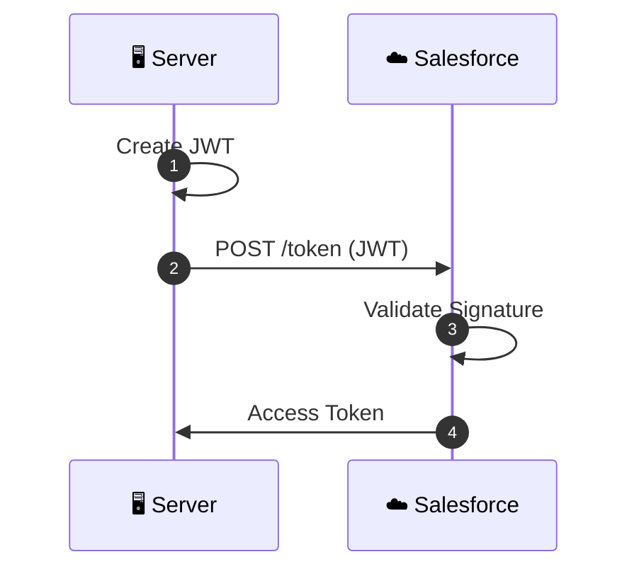

# 📊 sf-diagram-mermaid

> Salesforce architecture diagram generation using Mermaid syntax with ASCII fallback

[](https://opensource.org/licenses/MIT)
[](https://github.com/anthropics/claude-code)

## Overview

`sf-diagram-mermaid` is a Salesforce architecture diagram skill that generates professional diagrams using [Mermaid](https://mermaid.js.org/) syntax with ASCII art fallback for terminal compatibility.

## Features

- 🔐 **OAuth Flows** - Authorization Code, PKCE, JWT Bearer, Client Credentials, Device Flow
- 📊 **Data Models** - ERD diagrams with sf-metadata integration
- 🔄 **Integrations** - Sequence diagrams for API patterns
- 🏗️ **Architecture** - System landscape overviews
- 👥 **Role Hierarchies** - Security model visualization
- 🤖 **Agentforce** - Agent topic and action flows
- ♿ **Accessible** - Color-blind friendly palette
- 📟 **Terminal Friendly** - ASCII fallback for all diagrams

## Installation

```bash
# Install as part of sf-skills
npx skills add ./

# Or install just this skill
npx skills add ./ --skill sf-diagram-mermaid
```

## Quick Start

```
# Generate an OAuth diagram
"Create a JWT Bearer OAuth flow diagram"

# Generate a data model
"Create an ERD for Account, Contact, and Opportunity"

# Generate an integration diagram
"Diagram our Salesforce to SAP sync flow"
```

## Diagram Types

| Type | Template | Use Case |
|------|----------|----------|
| 🔐 Authorization Code | `oauth/authorization-code.md` | Web apps with backends |
| 🔐 PKCE Flow | `oauth/authorization-code-pkce.md` | Mobile/SPA apps |
| 🔐 JWT Bearer | `oauth/jwt-bearer.md` | Server-to-server, CI/CD |
| 🔐 Client Credentials | `oauth/client-credentials.md` | Service accounts |
| 🔐 Device Flow | `oauth/device-authorization.md` | CLI tools, IoT |
| 🔐 Refresh Token | `oauth/refresh-token.md` | Token renewal |
| 📊 Data Model | `datamodel/salesforce-erd.md` | Object relationships |
| 🔄 Integration | `integration/api-sequence.md` | API callout patterns |
| 🏗️ Architecture | `architecture/system-landscape.md` | System overview |
| 👥 Role Hierarchy | `role-hierarchy/user-hierarchy.md` | Security model |
| 🤖 Agentforce | `agentforce/agent-flow.md` | AI agent architecture |

## Scoring System (80 Points)

| Category | Points | Criteria |
|----------|--------|----------|
| Accuracy | 20 | Correct actors, flow steps, relationships |
| Clarity | 20 | Readable labels, logical layout |
| Completeness | 15 | All key elements included |
| Styling | 15 | Color scheme, theming, annotations |
| Best Practices | 10 | Proper notation, UML conventions |

## Color Palette

Tailwind-inspired pastel colors with dark borders (see [references/color-palette.md](references/color-palette.md)):

| Component | Fill (200) | Stroke (700+) |
|-----------|------------|---------------|
| AI & Agents | `#fbcfe8` | `#be185d` |
| Integration | `#fed7aa` | `#c2410c` |
| Development | `#ddd6fe` | `#6d28d9` |
| Metadata | `#a5f3fc` | `#0e7490` |
| Data | `#fde68a` | `#b45309` |
| Deploy | `#a7f3d0` | `#047857` |

## Example Output

### Mermaid Diagram


### ASCII Fallback
```
┌───────────────┐     ┌───────────────┐
│    Server     │     │   Salesforce  │
└───────┬───────┘     └───────┬───────┘
        │  1. Create JWT      │
        │  2. POST /token     │
        │────────────────────>│
        │                     │
        │  3. Validate JWT    │
        │                     │
        │  4. Access Token    │
        │<────────────────────│
```

## Cross-Skill Integration

| Skill | Integration |
|-------|-------------|
| sf-metadata | Auto-discover objects/fields for ERD |
| sf-connected-apps | Link OAuth flows to app setup |
| sf-ai-agentscript | Visualize agent architecture |

## Documentation

- [Color Palette](references/color-palette.md) - Styling guide
- [Mermaid Reference](references/mermaid-reference.md) - Syntax quick reference
- [Diagram Conventions](references/diagram-conventions.md) - Consistency rules

## Contributing

Contributions welcome! Please read [CONTRIBUTING.md](../../CONTRIBUTING.md) for guidelines.

## Credits

- OAuth flow accuracy inspired by [CloudSundial](https://cloudsundial.com/)
- Color accessibility based on Jon Jordan's work at Salesforce
- Mermaid syntax from [mermaid-js](https://github.com/mermaid-js/mermaid)

## License

MIT License - See [LICENSE](../../LICENSE) file
